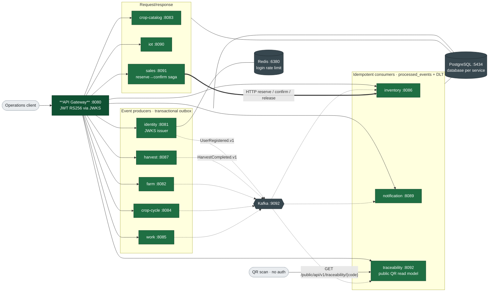

# AgriCore – Agricultural Enterprise Management Platform

Portfolio-grade **Java 21 / Spring Boot microservices** platform for enterprise crop production: farms, plots, crop catalog, seasons, field work, harvest, inventory, IoT, sales, and QR traceability.

## Status

**Full 12-service portfolio live** on `main`: compose stack, gateway JWT e2e (farm→cycle→work→harvest→Kafka→inventory→QR), Helm charts, CI (Maven + Gitleaks + Compose config), CodeQL, Trivy FS, and Docker Hub images under `nguyenson1710/agricore-*`.

| Service | Port | Image |
|---------|------|--------|
| api-gateway | 8080 | `nguyenson1710/agricore-gateway` |
| identity-service | 8081 | `nguyenson1710/agricore-identity` |
| farm-service | 8082 | `nguyenson1710/agricore-farm` |
| crop-catalog-service | 8083 | `nguyenson1710/agricore-crop-catalog` |
| crop-cycle-service | 8084 | `nguyenson1710/agricore-crop-cycle` |
| work-service | 8085 | `nguyenson1710/agricore-work` |
| inventory-service | 8086 | `nguyenson1710/agricore-inventory` |
| harvest-service | 8087 | `nguyenson1710/agricore-harvest` |
| notification-service | 8089 | `nguyenson1710/agricore-notification` |
| iot-service | 8090 | `nguyenson1710/agricore-iot` |
| sales-service | 8091 | `nguyenson1710/agricore-sales` |
| traceability-service | 8092 | `nguyenson1710/agricore-traceability` |

Tags: `latest`, short git SHA, full commit SHA. Images publish only after successful default-branch `ci`.

## Demo

One command brings the whole platform up; one script drives a real business transaction across
every service. This is `scripts/e2e-happy-path.ps1` against a clean stack — nothing staged, nothing
edited afterwards:


What it proves, in order: a real RS256 token from identity, a farm and plot through the gateway, an
**illegal crop-cycle stage transition rejected with 409** and the platform `ApiError` body, the four
legal stages, a work task, a harvest write that lands in the outbox, the **inventory consumer
stocking 500 kg from Kafka**, and the **public QR projection** resolving to `CAPHER-70543A22`.

```bash
docker compose up -d
pwsh scripts/e2e-happy-path.ps1     # or: ./scripts/verify-platform.sh
```

### The event backbone

Five outbox topics and the three idempotent consumer groups, from the same run:


Producers write to `outbox_events` in the same transaction as the domain change; a polling publisher
drains it. Consumers dedupe on `(event_id, consumer_name)` and route poisoned messages to a DLT.

## Architecture



Solid arrows are synchronous HTTP; dotted arrows are Kafka events; the thick arrow is the sales
saga's inbound call to inventory.

- **Database per service** (PostgreSQL)
- **Transactional outbox** on identity / farm / crop-cycle / work / harvest
- **Idempotent Kafka consumers** (inventory, traceability, notification + DLT)
- Every service has its own README with endpoints, env vars, and a runbook
- Docs: [Codebase Summary](docs/codebase-summary.md) · [System Architecture](docs/architecture/SYSTEM_ARCHITECTURE.md) ·
  [Deployment](docs/deployment-guide.md) · [Code Standards](docs/code-standards.md) ·
  [Design Guidelines](docs/design-guidelines.md) · [Roadmap](docs/project-roadmap.md) ·
  [Overview/PDR](docs/project-overview-pdr.md) · [ADRs](docs/adr/)

## Prerequisites

- JDK 21+ (compile target 21)
- Maven 3.9+
- Docker / Docker Compose

## Quick start

### 1. Infrastructure

```powershell
# Windows
.\scripts\dev-up.ps1
```

```bash
# Linux/macOS
./scripts/dev-up.sh
```

Starts PostgreSQL (multi-DB on host **5434**), Redis (**6380**), Kafka (**9092**), Kafka UI (`http://localhost:8088`).

> Ports 5434/6380 avoid clashes with other local stacks. Override via `.env` if needed.

### 2. Build & test

```bash
mvn verify
```

JaCoCo reports one coverage file per module during `verify`. Thresholds are measured but not yet
enforced — see [Roadmap](docs/project-roadmap.md) for the current baseline and the strict-flip plan.

### 3. Run services locally

```bash
# terminals
mvn -pl services/identity-service spring-boot:run
mvn -pl services/farm-service spring-boot:run
mvn -pl services/crop-catalog-service spring-boot:run
mvn -pl services/api-gateway spring-boot:run
```

### 4. Full Docker stack

```bash
# Local build
docker compose up --build

# Or pull published images (after login to Docker Hub if private)
docker pull nguyenson1710/agricore-gateway:latest
```

JWT keys for identity (once):

```powershell
.\scripts\generate-jwt-keys.ps1
```

Gateway: `http://localhost:8080`

### 5. Platform verification (gating)

One script builds/starts the **full** compose stack (infra + all app services with healthchecks), runs Maven tests, and executes the gateway JWT e2e happy path, writing an evidence bundle:

```powershell
# Windows — evidence dir is where compose-ps.txt, traceability.json, mvn-test.log land
.\scripts\verify-platform.ps1 -EvidenceDir C:\path\to\evidence
```

```bash
# Linux/macOS (requires pwsh for e2e)
export EVIDENCE_DIR=./.verify-evidence
./scripts/verify-platform.sh
```

Artifacts produced under the evidence directory:

| File | Content |
|------|---------|
| `compose-ps.txt` | `docker compose ps` including **app** containers (identity, farm, harvest, inventory, traceability, gateway, …) |
| `mvn-test.log` | full `./mvnw test` |
| `e2e-flow.log` | gateway JWT farm→cycle→harvest→Kafka flow |
| `traceability.json` | public QR response body (`farmName`, `plotCode`, `productName`) |
| `git-log.txt` | recent conventional commits |

Standalone e2e (stack already up):

```powershell
.\scripts\e2e-happy-path.ps1 -EvidenceDir C:\path\to\evidence
```

## Auth examples

```bash
# Register
curl -s -X POST http://localhost:8080/api/v1/auth/register \
  -H "Content-Type: application/json" \
  -d '{"email":"manager@agricore.local","password":"Secret123!","fullName":"Farm Manager"}'

# Login
curl -s -X POST http://localhost:8080/api/v1/auth/login \
  -H "Content-Type: application/json" \
  -d '{"email":"manager@agricore.local","password":"Secret123!"}'
```

JWKS: `GET /.well-known/jwks.json`

## Default roles

`SYSTEM_ADMIN` · `FARM_MANAGER` · `AGRONOMIST` · `FIELD_WORKER` · `WAREHOUSE_MANAGER` · `SALES_STAFF` · `AUDITOR`

New users receive `FIELD_WORKER`. Promote via `PATCH /api/v1/admin/users/{id}/roles` (admin only).

## Seeded crops

Robusta coffee, Ri6 durian, red dragon fruit, ST25 rice, lettuce, tomato, black pepper.

## Project layout

```text
services/          Spring Boot microservices
libs/common-lib/   API errors, event envelope (no domain)
libs/common-security/  JWT resource-server validation shared by every service
contracts/         OpenAPI / AsyncAPI schemas
infrastructure/    Docker, Helm chart, K8s network policy, monitoring
docs/              Architecture, ADRs, runbooks
scripts/           Dev stack, JWT key generation, platform verification
```

## Security notes

- Passwords: BCrypt (cost 12 production)
- Access tokens: short-lived RS256 JWT
- Refresh tokens: opaque, hashed, rotated; reuse revokes family
- Account lockout after failed logins
- Login rate limit via Redis
- **Never commit** `.env`, private keys, or production secrets

## CI

GitHub Actions on every push and PR: `ci` (Maven build + test, Gitleaks secret scan, OpenAPI
contract check, compose config validation), `codeql` (SAST), and `trivy` (filesystem + dependency
scan).

Images publish only when **all three** succeed for that exact commit. `ci` triggers the publish
workflow, which then reads back the `trivy` and `codeql` conclusions for the same SHA; a failed,
missing, or still-running scan blocks the publish and the run log says which one and why.

The contract check fails the build when `contracts/openapi/` stops describing the controllers —
in either direction — or when the shared `ApiError` schema drifts between service contracts.

## Contributing

Setup, test commands, commit conventions, and the architecture rules a PR must respect are in
[CONTRIBUTING.md](CONTRIBUTING.md). Please read [SECURITY.md](SECURITY.md) before reporting a
vulnerability — report privately, not as a public issue. Participation is covered by the
[Code of Conduct](CODE_OF_CONDUCT.md). Notable changes are recorded in [CHANGELOG.md](CHANGELOG.md).

## License

[MIT](LICENSE) © Nguyen Tien Son
