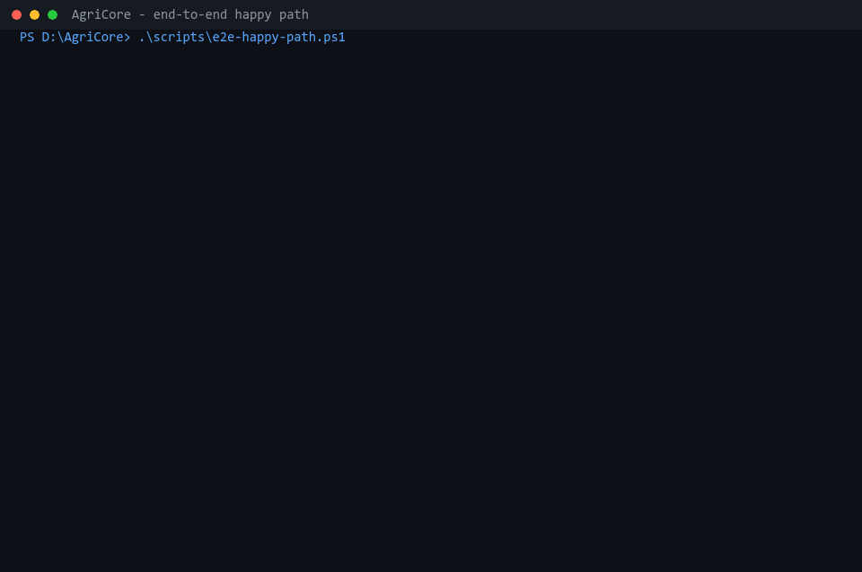
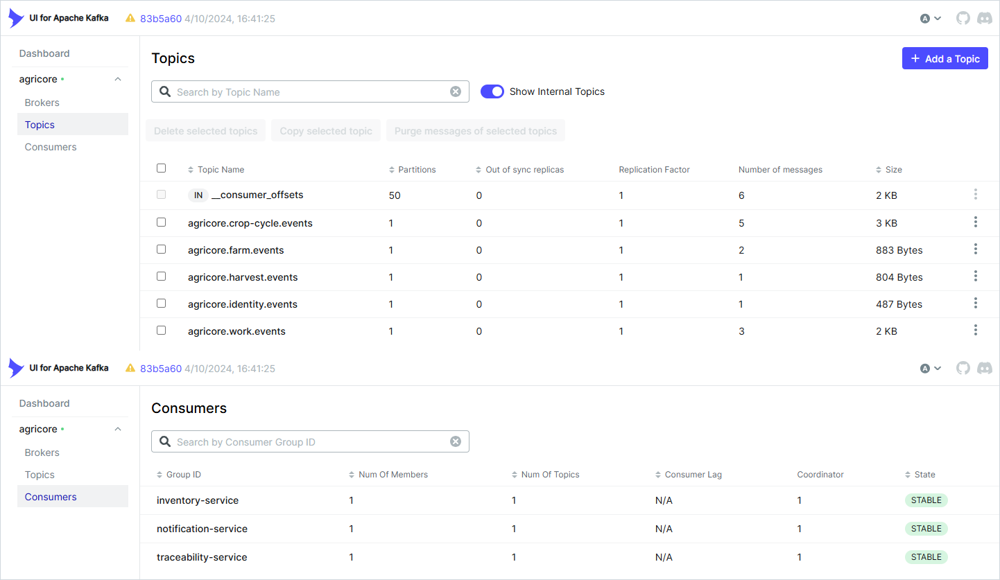
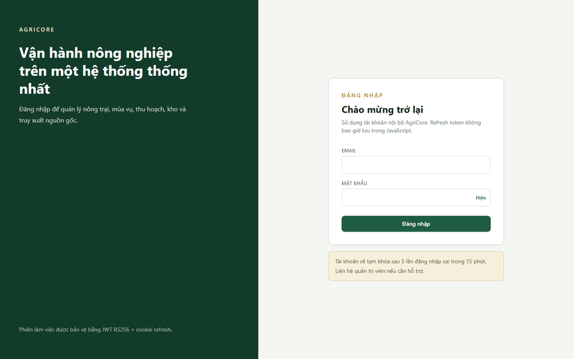
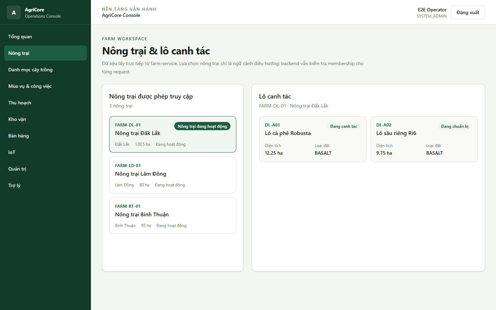
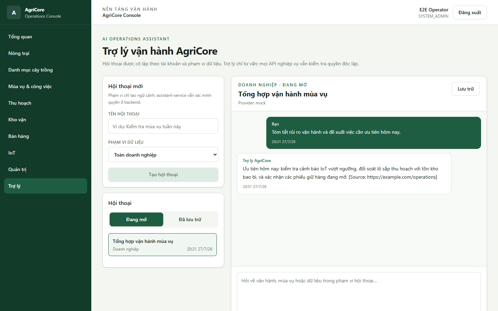

# AgriCore – Agricultural Enterprise Management Platform

## Project overview

AgriCore is a Java 21 and Spring Boot microservices platform for farm operations: farms, crop catalog, crop cycles, field work, harvest, inventory, IoT, sales, notifications, QR traceability, and a bounded assistant. A React console provides the browser interface through a same-origin Nginx edge.

## Problem

Agricultural enterprises often split farm maps, crop plans, field evidence,
stock, telemetry, sales, and origin records across disconnected tools. AgriCore
keeps those capabilities independently owned while providing one authenticated
operational path and a public-safe traceability view.

## Features

- Farm-scoped identity, roles, permissions, plots, crop cycles, and field work.
- Private image evidence, expiry-aware inventory, harvest projection, and QR traceability.
- Authenticated MQTT/HTTP telemetry, deduplication, alerts, and offline detection.
- Durable sales reservation saga, truthful notifications, and compensation.
- Persisted read-only assistant with replayable SSE, bounded farm tools, cited RAG, budgets, and retention.
- Accessible React console, deterministic demo data/media, observability, Compose, Helm, and supply-chain gates.

## Status

Feature-complete and release-verified on
[`a7568aec`](docs/evidence/release-closeout-2026-07-28.md): the repository
contains 13 Spring applications, the React console, local Compose stacks, a
Helm application chart, automated quality/security gates, and SHA-only Docker
Hub/GitHub Packages promotion. A revision is release-accepted only when the
default-branch CI and Docker Publish workflows succeed for that exact commit,
including image scanning, cross-registry digest equality, and Cosign
verification. This repository has no SemVer release tag and does not claim a
production deployment; package publication is an immutable build artifact, not
an operator deployment.

## Microservices

| Application | Port | Image |
|---|---:|---|
| API gateway | 8080, internal in Compose | `nguyenson1710/agricore-gateway` |
| Identity service | 8081 | `nguyenson1710/agricore-identity` |
| Farm service | 8082 | `nguyenson1710/agricore-farm` |
| Crop catalog service | 8083 | `nguyenson1710/agricore-crop-catalog` |
| Crop cycle service | 8084 | `nguyenson1710/agricore-crop-cycle` |
| Work service | 8085 | `nguyenson1710/agricore-work` |
| Inventory service | 8086 | `nguyenson1710/agricore-inventory` |
| Harvest service | 8087 | `nguyenson1710/agricore-harvest` |
| Notification service | 8089 | `nguyenson1710/agricore-notification` |
| IoT service | 8090 | `nguyenson1710/agricore-iot` |
| Sales service | 8091 | `nguyenson1710/agricore-sales` |
| Traceability service | 8092 | `nguyenson1710/agricore-traceability` |
| Assistant service | 8093, internal | `nguyenson1710/agricore-assistant` |
| React console | 3000 on host | `nguyenson1710/agricore-console` |

The configured default-branch workflow builds, scans, parity-checks, and signs
one candidate digest per image before promoting only seven-character and
full-SHA tags to Docker Hub and GitHub Packages. It never promotes `latest`;
package existence is established by the successful Docker Publish run for the
corresponding default-branch commit.

## Demo

After completing [Quick start](#quick-start), the following commands bring the
platform up and exercise its critical authenticated/event-driven paths against
a quiescent stack. The GIF is rendered from captured console output with
`tools/render-e2e-gif.ps1`; executable assertions in
`scripts/e2e-happy-path.ps1` remain the source of truth:



What the script verifies, in order: an authenticated JWT issued by Identity; Farm, Plot, Crop Cycle, and
Work Task operations through the gateway; an **illegal crop-cycle stage transition rejected with
409**; the legal stage path; a 90 kg net harvest written with its outbox event; Inventory and
Traceability projections caught up from Kafka; the dynamically generated public traceability code;
idempotent duplicate handling in Inventory, Traceability, and Notification; and invalid harvest
events delivered to the DLT.

```bash
docker compose up -d
pwsh scripts/e2e-happy-path.ps1     # or: ./scripts/verify-platform.sh
```

Run the acceptance script without concurrent harvest-producing workloads because its Inventory
delta assertion observes the shared `COFFEE-ROBUSTA` test SKU.

### The event backbone

Runtime Kafka view showing five event topics and the three idempotent consumer groups:



Producers write to `outbox_events` in the same transaction as the domain change; a polling publisher
drains it. Consumers dedupe on `(event_id, consumer_name)` and route poisoned messages to a DLT.

## Architecture

```text
Browser :3000 ── Nginx ── /api, /public/api ── API Gateway :8080
                                                ├─ Identity, Farm, Catalog
                                                ├─ Cycle, Work, Harvest, Inventory
                                                └─ Traceability, IoT, Sales, Notification, Assistant

Identity transactional outbox ── UserRegistered.v1 ── Notification
Harvest transactional outbox ── Kafka ── Inventory + Traceability
Sales ── bounded reserve/confirm ── durable recovery
```

- Database per service with PostgreSQL and Flyway.
- Kafka event mesh: Identity registration, Sales, Traceability, and IoT feed
  Notification; Harvest feeds Inventory and Traceability. Every event producer
  uses a transactional outbox.
- Transactional outbox publishers across identity, farm, crop-cycle, work,
  harvest, inventory, IoT, traceability, sales, and notification.
- Farm-scoped `HarvestCompleted.v1` consumers in Inventory and Traceability,
  plus Notification consumers for Identity, Sales, Traceability, and IoT
  events. Invalid notification envelopes/payloads bypass retry topics and go
  to the DLT without creating a delivery or processed marker.
- External notification delivery is at-most-once automatically: an ambiguous
  stale delivery becomes `FAILED` with `DELIVERY_OUTCOME_UNKNOWN` instead of
  being resent. Persisted `IN_APP` delivery can be reclaimed safely.
- Versioned JSON Schema and AsyncAPI contracts for implemented domain events.
- RS256 JWTs, JWKS validation, canonical permission guards, permission-aware console navigation, and farm membership authorization.
- Persisted assistant with authenticated replayable SSE, read-only farm tools, and Redis-backed budgets.
- PostgreSQL excludes overlapping `DRAFT`/`ACTIVE` crop-cycle date ranges for
  one plot, closing the concurrent-insert race left by application checks alone.

See the [documentation index](docs/README.md), [System Architecture](docs/architecture/SYSTEM_ARCHITECTURE.md), [ADRs](docs/adr/), and [local operations](docs/runbooks/local-operations.md).

### Service references

Each Spring application has module-local setup and runbook notes. Versioned
contracts and the platform docs remain authoritative for cross-service
behavior.

| Platform and identity | Farm operations | Supply chain and support |
|---|---|---|
| [API gateway](services/api-gateway/README.md) | [Identity](services/identity-service/README.md) | [Farm](services/farm-service/README.md) |
| [Crop catalog](services/crop-catalog-service/README.md) | [Crop cycle](services/crop-cycle-service/README.md) | [Work](services/work-service/README.md) |
| [Harvest](services/harvest-service/README.md) | [Inventory](services/inventory-service/README.md) | [Traceability](services/traceability-service/README.md) |
| [IoT](services/iot-service/README.md) | [Sales](services/sales-service/README.md) | [Notification](services/notification-service/README.md) |
| [Assistant](services/assistant-service/README.md) | | |

## Technology stack

Java 21/Spring Boot, PostgreSQL/TimescaleDB, Redis, Kafka, MQTT, MinIO,
React/TypeScript/Vite, Docker Compose, Helm, GitHub Actions, and the
Prometheus/Tempo/Loki/Grafana observability stack. See the
[codebase summary](docs/codebase-summary.md) for versions and boundaries.

## Event documentation

Async channels live in [`contracts/asyncapi`](contracts/asyncapi/) and immutable
payload schemas in [`contracts/event-schemas`](contracts/event-schemas/). See
the [dependency diagram](docs/diagrams/service-dependencies.md) and
[Kafka retry/DLT runbook](docs/runbooks/kafka-dlq.md) for topology and repair.

## Product walkthrough

The media below is captured from the built React Operations Console running
against the repository's deterministic browser-test edge. It shows the
application itself—not concept art—and contains no production credentials,
tokens, or customer data.



| Farms and plots | Operations assistant |
|---|---|
| [](assets/images/agricore-console/agricore-console-farms.png) | [](assets/images/agricore-console/agricore-console-assistant.png) |

[Secure login](assets/images/agricore-console/agricore-console-login.png) ·
[Dashboard](assets/images/agricore-console/agricore-console-dashboard.png) ·
[capture provenance](assets/images/agricore-console/README.md)

The optimized farm and produce images under
[`assets/media/agricore-showcase`](assets/media/agricore-showcase/) are runtime
dashboard content only; they are not presented as application screenshots.

## System requirements

JDK 21+, Maven 3.9+ (or the wrapper), Node.js 22.13+, pnpm 11+, Docker Compose,
and OpenSSL for local JWT key generation.

## Environment variables

Copy [`.env.example`](.env.example) only for local development. It documents database, Redis, Kafka, MQTT, SMTP, MinIO, JWT, observability, assistant provider, budget, retention,
required `AGRICORE_CLIENT_IP_SIGNING_SECRET`, and client-IP edge values. Set the secret before Compose starts.
The local `client-ip-edge` attaches only Console and Gateway at default `172.30.0.2`/`172.30.0.3`; change all four
`CLIENT_IP_EDGE_*`/`GATEWAY_TRUSTED_PROXY_ADDRESS_PATTERN` values together when changing the subnet.
Keep `.env`, RSA private keys, registry tokens, database credentials, and provider keys outside Git. Helm consumes environment-owned values and pre-created Kubernetes Secrets.

## Quick start

Create local configuration and JWT keys once:

```powershell
Copy-Item .env.example .env
.\scripts\generate-jwt-keys.ps1
```

Start infrastructure first so Compose creates the `agricore_default` network, then observability, then the applications:

```powershell
docker compose up -d postgres redis kafka kafka-ui kafka-topics-init mqtt minio
docker compose -f docker-compose.observability.yml up -d
docker compose up -d --build
```

| Endpoint | URL |
|---|---|
| Console | `http://localhost:3000` |
| API and JWKS through the same-origin edge | `http://localhost:3000` |
| Kafka UI | `http://localhost:8088` |
| Mailpit | `http://localhost:8025` |
| MQTT broker | `tcp://localhost:1883` |
| MinIO API | `http://localhost:9000` |
| MinIO console | `http://localhost:9001` |
| Grafana | `http://localhost:3001` |
| Prometheus | `http://localhost:9090` |
| Tempo | `http://localhost:3200` |

The gateway and assistant are not host-published by Compose. Use the console
edge at `http://localhost:3000`; it proxies `/api`, `/public/api`, and
`/.well-known/jwks.json`. `ASSISTANT_PROVIDER=none` is the safe default;
provider type, model, base URL, and API key belong only in a local `.env`,
secret manager, or Kubernetes Secret.

Assistant data has explicit retention controls: archived conversations default
to 90 days, audit events to 365 days, and replay events to 24 hours. A bounded
hourly cleanup job exposes purged-record and failure counters. Review
`ASSISTANT_*_RETENTION` and cleanup settings against the deployment's legal and
operational requirements before production use.

Local email delivery uses Mailpit. Notification state is persisted as
`REQUESTED` before delivery and ends as `SENT` or `FAILED`; captured development
email is visible in the Mailpit UI. External channels receive at most one
automatic delivery attempt. If the process loses the provider result, recovery
records `FAILED` with `DELIVERY_OUTCOME_UNKNOWN` instead of risking a duplicate
send. Event-driven `IN_APP` deliveries are persisted in the administrative
inbox and can be retried safely. A `SYSTEM_ADMIN` with
`NOTIFICATION_ADMIN` can page `GET /api/v1/notifications/in-app` and mark an
entry read with
`PATCH /api/v1/notifications/in-app/{notificationId}/read`.

For deterministic demo data, set a local-only `AGRICORE_SEED_PASSWORD`, preview
with `.\scripts\seed-data.ps1 -Profile Large -DryRun`, then remove `-DryRun`.
`Smoke`/`Quick`, `Demo`/`Showcase`, and `Large` are bounded aliases. Large
creates or reuses 32 farms, 768 plots, 32 production flows, 128 tasks with
repository WebP evidence, 32 harvest-to-inventory/traceability projections,
640 IoT readings, 16 confirmed sales sagas with notifications, and one
assistant conversation. It checks free space throughout, throttles writes, and
can be run repeatedly without duplicating authoritative records. See the
[local operations runbook](docs/runbooks/local-operations.md#deterministic-development-dataset).

IoT devices publish authenticated QoS 1 JSON to `agricore/telemetry/{deviceCode}/reading`. Every MQTT payload requires a stable `readingId`, and `iot-service` deduplicates redelivery by that ID while rejecting ID reuse with different telemetry. Local Mosquitto bootstraps non-anonymous service/device users from environment variables and restricts each device user to its own topic. IoT admission also applies a per-device token bucket and in-flight limit before queued processing, with bounded tracked-device state. Run a deterministic simulator with `./scripts/sensor-simulator.ps1 -DeviceCount 3 -Iterations 10 -FrequencySeconds 2 -MinimumValue 30 -MaximumValue 70 -AnomalyProbabilityPercent 20 -Seed 42`; the POSIX equivalent is the `iot-mqtt-simulator` Compose profile. Register the mapped device codes first. Production must provide authenticated TLS plus broker ACLs managed outside this repository.

For an existing PostgreSQL volume, follow the [assistant database provisioning runbook](docs/runbooks/assistant-database-provisioning.md).

## Testing

```bash
./mvnw -B verify
pnpm install --frozen-lockfile
pnpm contracts:check
pnpm lint
pnpm typecheck
pnpm test
pnpm build
```

Docker is required for the Testcontainers migration tests. CI also runs
Playwright (`pnpm e2e`). For full stack, E2E, and k6 instructions, see the
[local operations runbook](docs/runbooks/local-operations.md).

## Observability

All 13 Spring applications expose Prometheus metrics and trace through
OTLP/HTTP to Tempo; local logs flow through Alloy to Loki and Grafana. See
[local operations](docs/runbooks/local-operations.md) for endpoints, retention,
dashboards, and verification commands.

## API documentation

Versioned [OpenAPI contracts](contracts/openapi/) drive the generated console
client; protected browser requests use `/api` and public traceability uses
`/public/api`. See the [Identity contract](contracts/openapi/identity-service.v1.yaml)
and [authorization model](docs/security/microservices-authz.md).

## Deployment, security, and contribution

- [Deployment guide](docs/deployment-guide.md) — digest-pinned Helm releases,
  operator prerequisites, rollback boundaries, and package verification.
- [Security policy](SECURITY.md) and [security review](docs/security/SECURITY_REVIEW.md)
  — reporting, supported immutable artifacts, and threat boundaries.
- [Project roadmap](docs/project-roadmap.md) — verified scope and post-1.0 work.
- [CONTRIBUTING.md](CONTRIBUTING.md) — branch, test, contract, and PR rules.

The repository does not provision a hosted production cluster. Operators own
production infrastructure, secrets, TLS, backups, access policy, and retention;
assistant tools remain read-only. Released under the [MIT License](LICENSE).
