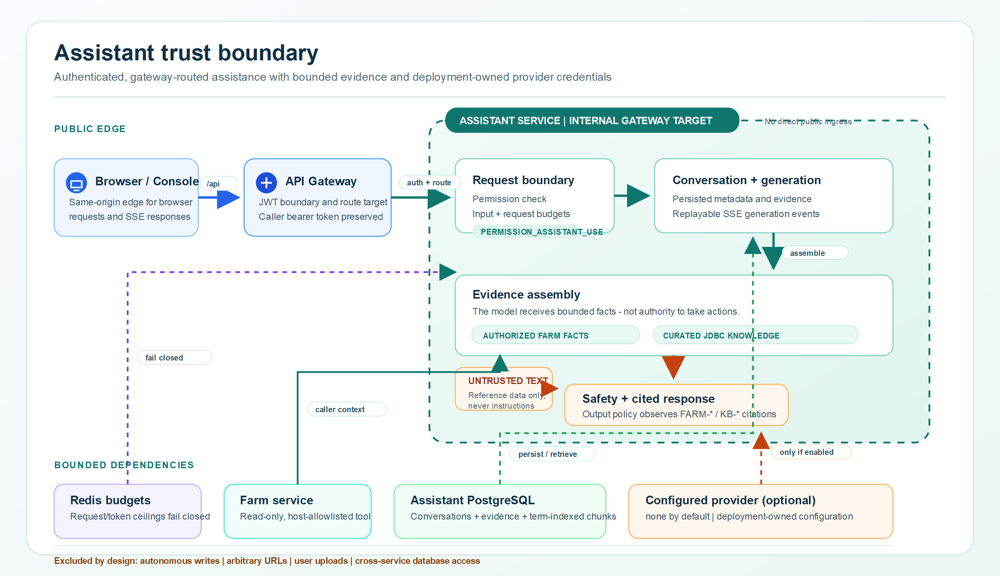

# Assistant RAG trust boundary

[Open the SVG source](../images/assistant-rag-trust-boundary.svg).

The Assistant accepts an authenticated conversation inside a deliberately
limited trust boundary. It can collect authorized, read-only Farm facts and
curated knowledge facts; it does not receive authority to mutate Farm data.

## Evidence sources and controls

- Farm facts are collected only for an authorized farm conversation, through
  read requests to Farm.
- Curated knowledge is a JDBC, term-indexed PostgreSQL store
  (`assistant_knowledge_chunks` plus `assistant_knowledge_terms`), not a
  vector database. It has no arbitrary web fetch or user-document upload path.
- Retrieved facts are untrusted reference data, never instructions. The output
  policy requires citations for evidence-backed responses and rejects citations
  that are not in the collected evidence.
- `ASSISTANT_PROVIDER=none` is the default, so no external provider is used
  until an operator configures one. Redis-backed request/token budgets deny a
  request when Redis cannot reserve the budget; they do not fail open.

## Boundary limits

This diagram does not claim that a provider is enabled in any environment or
that a deployment's secrets, ingress, retention, or monitoring controls have
been configured. See the [Assistant RAG operations runbook](../runbooks/assistant-rag-operations.md)
for rollout and failure handling, and the
[assistant boundary ADR](../adr/0009-persisted-assistant-boundary.md) for the
persisted-assistant decision.
