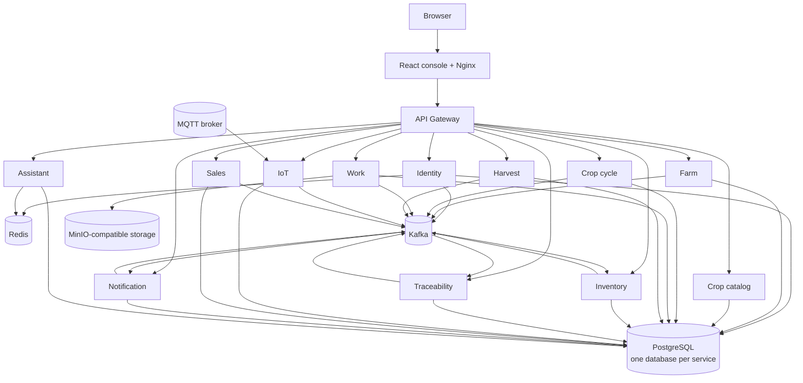

# Container architecture

```mermaid
flowchart TB
    browser["Browser"]
    edge["React console + Nginx"]
    gateway["API Gateway"]

    identity["Identity"]
    farm["Farm"]
    catalog["Crop catalog"]
    cycle["Crop cycle"]
    work["Work"]
    harvest["Harvest"]
    inventory["Inventory"]
    traceability["Traceability"]
    iot["IoT"]
    sales["Sales"]
    notification["Notification"]
    assistant["Assistant"]

    postgres[("PostgreSQL\none database per service")]
    redis[("Redis")]
    kafka[("Kafka")]
    mqtt[("MQTT broker")]
    minio[("MinIO-compatible storage")]

    browser --> edge --> gateway
    gateway --> identity
    gateway --> farm
    gateway --> catalog
    gateway --> cycle
    gateway --> work
    gateway --> harvest
    gateway --> inventory
    gateway --> traceability
    gateway --> iot
    gateway --> sales
    gateway --> notification
    gateway --> assistant

    identity --> postgres
    farm --> postgres
    catalog --> postgres
    cycle --> postgres
    work --> postgres
    harvest --> postgres
    inventory --> postgres
    traceability --> postgres
    iot --> postgres
    sales --> postgres
    notification --> postgres
    assistant --> postgres

    identity --> redis
    assistant --> redis
    mqtt --> iot
    work --> minio

    identity --> kafka
    farm --> kafka
    cycle --> kafka
    work --> kafka
    harvest --> kafka
    inventory --> kafka
    traceability --> kafka
    iot --> kafka
    sales --> kafka
    notification --> kafka
    kafka --> inventory
    kafka --> traceability
    kafka --> notification
```

The local environment uses one PostgreSQL container with isolated databases.
The database-per-service rule prohibits cross-service SQL joins and shared JPA
entities.
