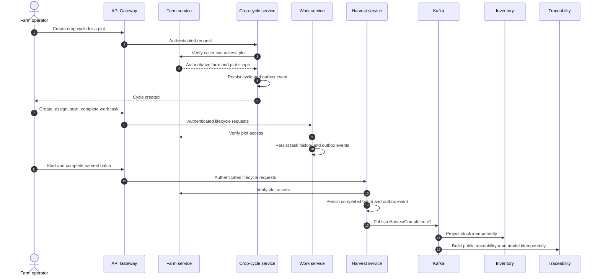

# Crop lifecycle sequence

```mermaid
sequenceDiagram
    autonumber
    actor User as Farm operator
    participant GW as API Gateway
    participant Farm as Farm service
    participant Cycle as Crop-cycle service
    participant Work as Work service
    participant Harvest as Harvest service
    participant Kafka
    participant Inventory
    participant Trace as Traceability

    User->>GW: Create crop cycle for a plot
    GW->>Cycle: Authenticated request
    Cycle->>Farm: Verify caller can access plot
    Farm-->>Cycle: Authoritative farm and plot scope
    Cycle->>Cycle: Persist cycle and outbox event
    Cycle-->>User: Cycle created

    User->>GW: Create, assign, start, complete work task
    GW->>Work: Authenticated lifecycle requests
    Work->>Farm: Verify plot access
    Work->>Work: Persist task history and outbox events

    User->>GW: Start and complete harvest batch
    GW->>Harvest: Authenticated lifecycle requests
    Harvest->>Farm: Verify plot access
    Harvest->>Harvest: Persist completed batch and outbox event
    Harvest->>Kafka: Publish HarvestCompleted.v1
    Kafka->>Inventory: Project stock idempotently
    Kafka->>Trace: Build public traceability read model idempotently
```

Farm access failures fail closed. Event delivery is at least once, so Inventory
and Traceability persist processed-event markers before acknowledging side
effects.
