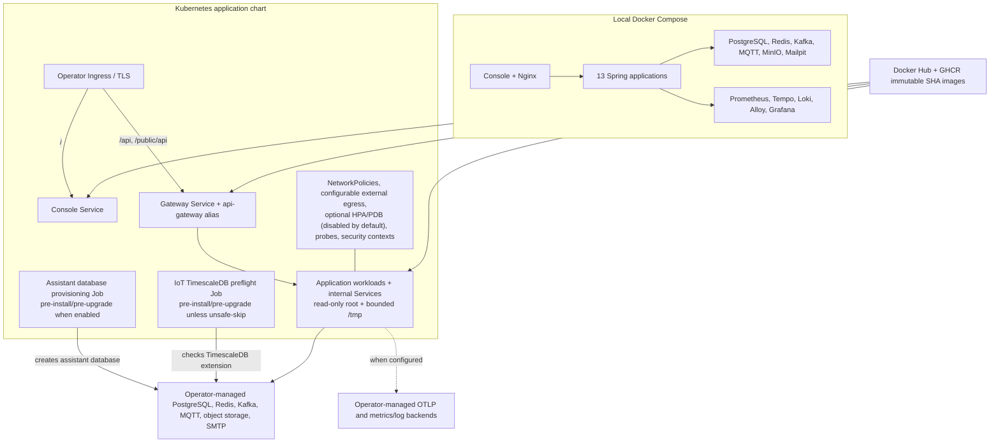

# Deployment architecture

The enabled Helm Ingress sends `/` only to Console and `/api` plus `/public/api`
only to Gateway. Other chart-created service endpoints remain internal and are
not Ingress backends. The Assistant database-provisioning and IoT TimescaleDB
preflight Jobs are conditional pre-install/pre-upgrade hooks; they use
operator-provided Kubernetes Secrets for their database access.

The Helm chart deploys applications, not stateful platform dependencies. Secrets,
TLS, Kafka authorization, database backups, storage classes, and observability
retention remain production operator responsibilities. HPA and PDB resources are
available but disabled by default. Egress is open by default for external
dependencies; restricted deployments must supply explicit `additionalEgress`
rules. The dashed observability edge exists only when the corresponding external
endpoints are configured. The ingress policy also allows the matching
`ingress-nginx` controller namespace/pod labels while denying other non-AgriCore
ingress.
