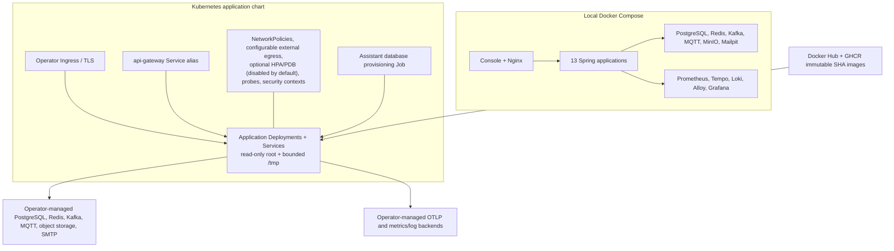

# Deployment architecture

The Helm chart deploys applications, not stateful platform dependencies. Secrets,
TLS, Kafka authorization, database backups, storage classes, and observability
retention remain production operator responsibilities. HPA and PDB resources are
available but disabled by default. Egress is open by default for external
dependencies; restricted deployments must supply explicit `additionalEgress`
rules. The ingress policy also allows the matching `ingress-nginx` controller
namespace/pod labels while denying other non-AgriCore ingress.
