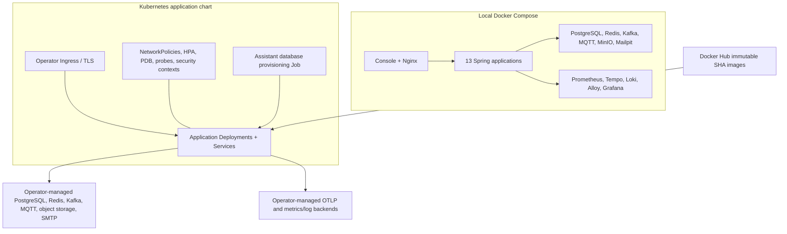

# Deployment architecture

The Helm chart deploys applications, not stateful platform dependencies. Secrets,
TLS, Kafka authorization, database backups, storage classes, and observability
retention remain production operator responsibilities.
