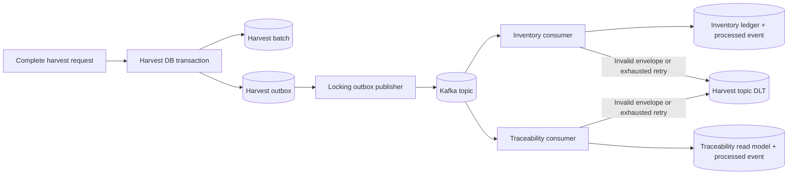

# Harvest event flow

The harvest aggregate and outbox row commit atomically. Consumer transactions
make duplicate delivery safe; wrong event types, wrong versions, and malformed
envelopes follow the bounded retry/DLT policy documented in the Kafka runbook.
