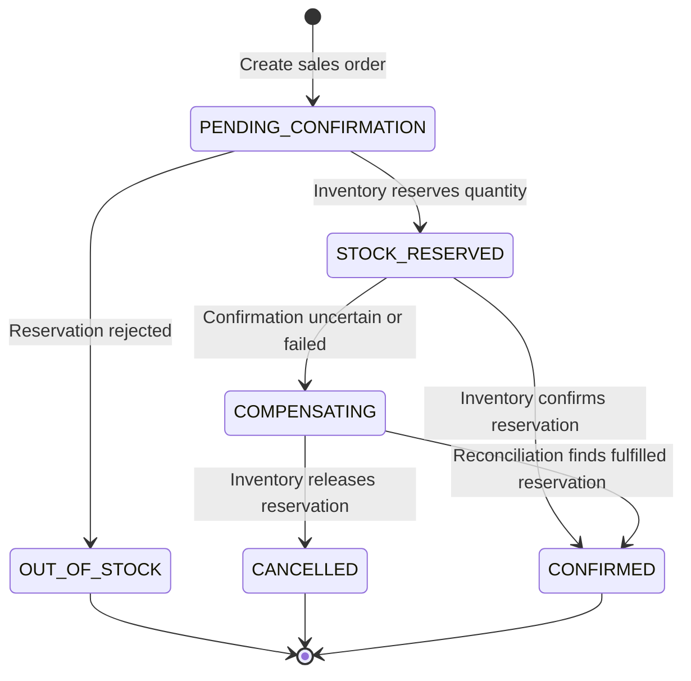
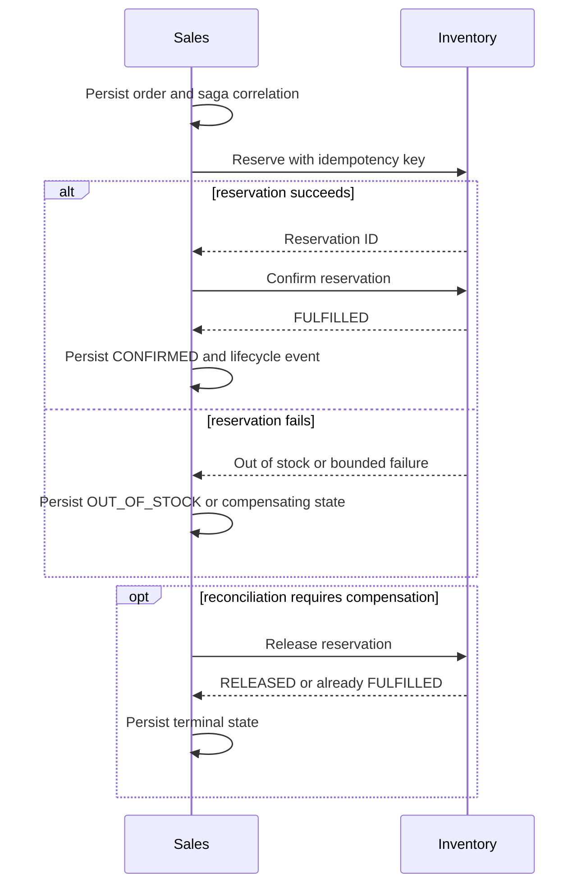

# Inventory reservation saga

```mermaid
stateDiagram-v2
    [*] --> PENDING_CONFIRMATION: Create sales order
    PENDING_CONFIRMATION --> OUT_OF_STOCK: Reservation rejected
    PENDING_CONFIRMATION --> STOCK_RESERVED: Inventory reserves quantity
    STOCK_RESERVED --> CONFIRMED: Inventory confirms reservation
    STOCK_RESERVED --> COMPENSATING: Confirmation uncertain or failed
    COMPENSATING --> CANCELLED: Inventory releases reservation
    COMPENSATING --> CONFIRMED: Reconciliation finds fulfilled reservation
    OUT_OF_STOCK --> [*]
    CANCELLED --> [*]
    CONFIRMED --> [*]
```

```mermaid
sequenceDiagram
    participant Sales
    participant Inventory

    Sales->>Sales: Persist order and saga correlation
    Sales->>Inventory: Reserve with idempotency key
    alt reservation succeeds
        Inventory-->>Sales: Reservation ID
        Sales->>Inventory: Confirm reservation
        Inventory-->>Sales: FULFILLED
        Sales->>Sales: Persist CONFIRMED and lifecycle event
    else reservation fails
        Inventory-->>Sales: Out of stock or bounded failure
        Sales->>Sales: Persist OUT_OF_STOCK or compensating state
    end
    opt reconciliation requires compensation
        Sales->>Inventory: Release reservation
        Inventory-->>Sales: RELEASED or already FULFILLED
        Sales->>Sales: Persist terminal state
    end
```

Sales owns the saga state; Inventory owns reservation truth. No transaction spans
both databases.
