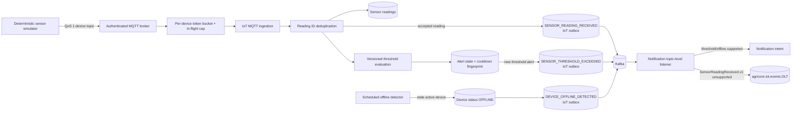

# IoT ingestion flow

HTTP ingestion shares the same application path after authentication. Stable
`readingId` values make QoS 1 redelivery idempotent; reusing an ID with different
payload data is rejected. Alert fingerprints and cooldowns suppress repeated
notifications: only a newly created alert writes a
`SENSOR_THRESHOLD_EXCEEDED` outbox event. The scheduled offline detector marks
each stale active device `OFFLINE` before writing its
`DEVICE_OFFLINE_DETECTED` outbox event. Both event types publish to
`agricore.iot.events` and are consumed by Notification.

Every accepted reading also writes `SensorReadingReceived.v1` to the same
topic. The current Notification listener subscribes at topic level but supports
only threshold and offline events, so it throws `IllegalArgumentException` for
`SensorReadingReceived.v1`; Spring Kafka bypasses retry and sends that record
to `agricore.iot.events.DLT`. This is a current shared-topic compatibility gap,
not an alert notification path. Monitor it as a known DLT source; filtering the
listener or separating the event topology is a code remediation outside this
documentation change. Device buckets, in-flight work, and tracked bucket count
are bounded before shared queue submission.
