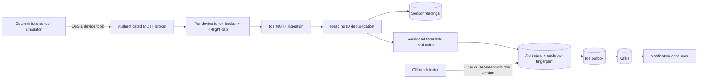

# IoT ingestion flow

HTTP ingestion shares the same application path after authentication. Stable
`readingId` values make QoS 1 redelivery idempotent; reusing an ID with different
payload data is rejected. Alert fingerprints and cooldowns suppress repeated
notifications. Device buckets, in-flight work, and tracked bucket count are
bounded before shared queue submission.
