# IoT ingestion flow

```mermaid
flowchart LR
    simulator["Deterministic sensor simulator"]
    broker["Authenticated MQTT broker"]
    quota["Per-device token bucket + in-flight cap"]
    ingestion["IoT MQTT ingestion"]
    dedupe["Reading ID deduplication"]
    readings[("Sensor readings")]
    readingOutbox[("SENSOR_READING_RECEIVED\nIoT outbox")]
    rules["Versioned threshold evaluation"]
    alerts[("Alert state + cooldown fingerprint")]
    thresholdOutbox[("SENSOR_THRESHOLD_EXCEEDED\nIoT outbox")]
    kafka[("Kafka")]
    notificationListener["Notification topic-level listener"]
    notification["Notification intent"]
    readingNoOp["No notification, processed-event marker, or outbox"]
    notificationDlt[("agricore.iot.events.DLT")]
    offline["Scheduled offline detector"]
    deviceStatus[("Device status OFFLINE")]
    offlineOutbox[("DEVICE_OFFLINE_DETECTED\nIoT outbox")]

    simulator -->|"QoS 1 device topic"| broker
    broker --> quota --> ingestion --> dedupe
    dedupe --> readings
    dedupe -->|"accepted reading"| readingOutbox --> kafka
    dedupe --> rules --> alerts
    alerts -->|"new threshold alert"| thresholdOutbox --> kafka
    offline -->|"stale active device"| deviceStatus --> offlineOutbox --> kafka
    kafka --> notificationListener
    notificationListener -->|"schema-valid SensorReadingReceived.v1: source validate then commit"| readingNoOp
    notificationListener -->|"threshold/offline supported"| notification
    notificationListener -->|"wrong reading source, version, or payload schema"| notificationDlt
```

HTTP ingestion shares the same application path after authentication. Stable
`readingId` values make QoS 1 redelivery idempotent; reusing an ID with different
payload data is rejected. Alert fingerprints and cooldowns suppress repeated
notifications: only a newly created alert writes a
`SENSOR_THRESHOLD_EXCEEDED` outbox event. The scheduled offline detector marks
each stale active device `OFFLINE` before writing its
`DEVICE_OFFLINE_DETECTED` outbox event. Both event types publish to
`agricore.iot.events` and are consumed by Notification.

Every accepted reading also writes `SensorReadingReceived.v1` to the same
topic. When the record is version 1, names `iot-service` as producer, and is
received on the configured IoT topic, Notification validates that source and
the published reading payload schema, then ignores the reading. Its successful
return commits the record without a notification, processed-event marker, or
outbox write. Threshold and offline events continue to create notification
intents on that same topic.

A reading with a wrong producer, wrong topic, version, or payload schema is
rejected with `IllegalArgumentException`; Spring Kafka bypasses retry and sends
it directly to `agricore.iot.events.DLT`. That DLT is not an expected
destination for valid source-matched version-1 readings. Device buckets,
in-flight work, and tracked bucket count are bounded before shared queue
submission.
