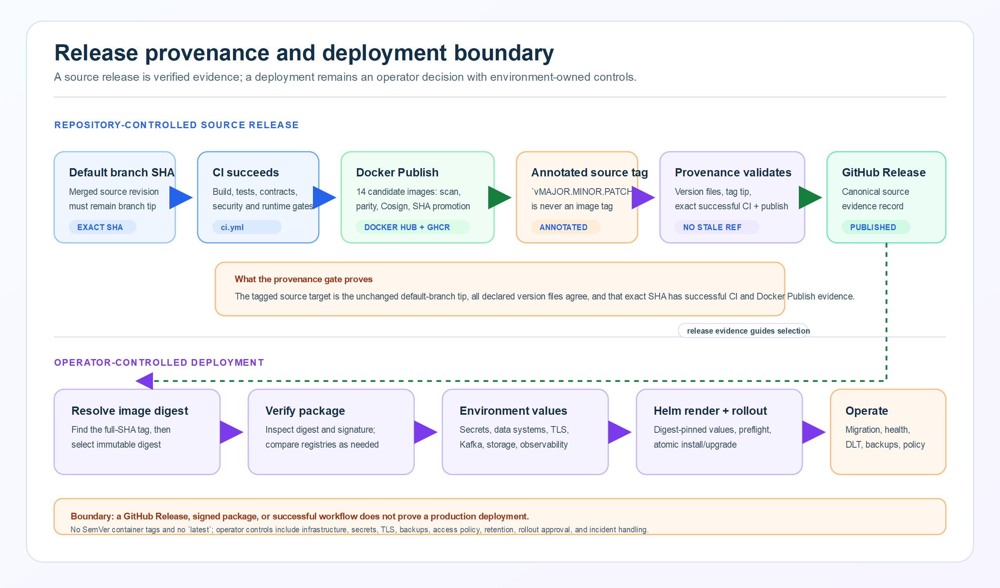

# Release provenance evidence chain

[Open the SVG source](../images/release-provenance-evidence-chain.svg).

## Evidence chain

| Stage | Evidence boundary |
|---|---|
| Prepared manifest | Defines scope and required checks only; it is not a source tag, CI result, package record, or deployment claim. |
| Annotated source tag | Identifies the source-release candidate; it is not a container tag. The release workflow requires the tag target to be the current default-branch tip. |
| CI and Docker Publish | The release workflow records the exact successful default-branch CI push run and Docker Publish run for that target. |
| Images | Docker Publish builds and verifies candidates, then promotes short- and full-SHA image tags. Resolve a full-SHA tag to its immutable digest before deployment. |
| GitHub Release | Created only after the source tag and matching workflow evidence pass validation; it is the canonical source-release record when present. |
| Operator deployment | Separate, operator-owned evidence: digest-pinned values, infrastructure and secrets, migration decision, rollout, and runtime controls. |

## Non-claims

A source tag, CI result, container tag, signature, digest, or GitHub Release
does not prove that a production environment was deployed. It also does not
prove operator controls such as ingress/TLS, access policy, database backup and
restore readiness, Kafka ACLs and retention, observability retention, or
incident response. Those controls are outside this repository's release
provenance chain.

See the [prepared v1.0.1 release manifest](../releases/v1.0.1.md), historical
[v1.0.0 release manifest](../releases/v1.0.0.md),
[evidence register](../evidence/README.md), and
[deployment guide](../deployment-guide.md#image-verification) for the verified
procedure and its operational boundary.
