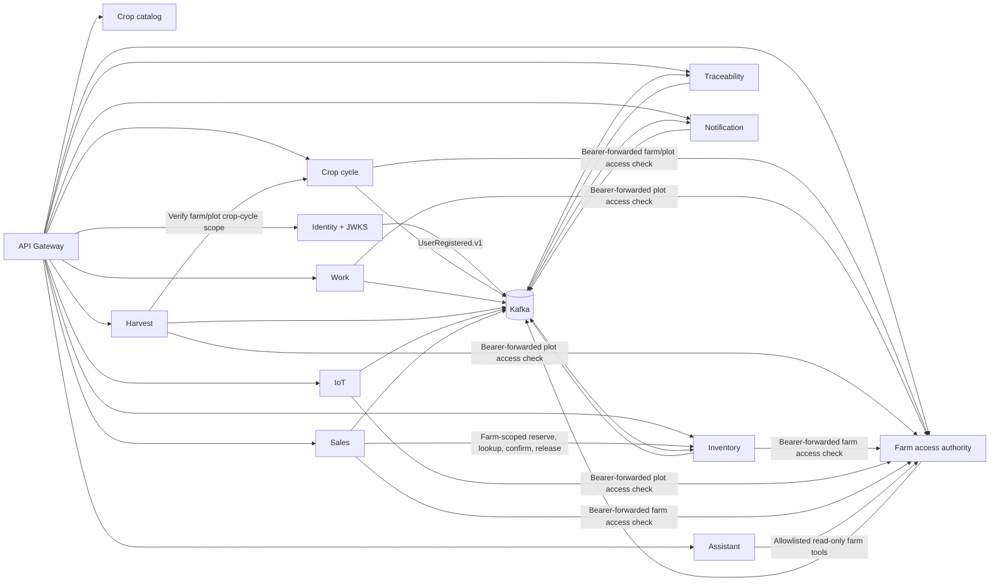

# Service dependencies

All servlet applications independently validate RS256 access tokens against the
Identity JWKS. Kafka arrows show implemented producers and consumers; they do
not imply a shared transaction.
