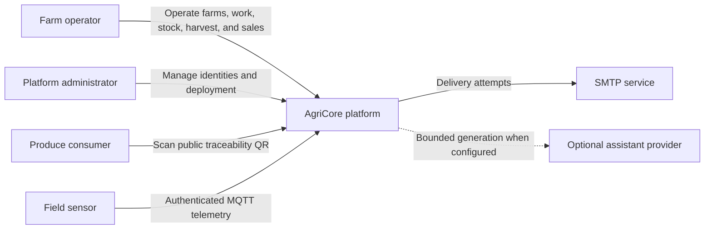

# System context

Trust boundaries:

- Browser and public QR traffic enter through the same-origin console edge and
  API gateway.
- Devices authenticate at the MQTT broker and can publish only to their own
  telemetry topic in the local profile.
- The assistant provider is disabled by default; its credential is a deployment
  secret and never a repository value.
