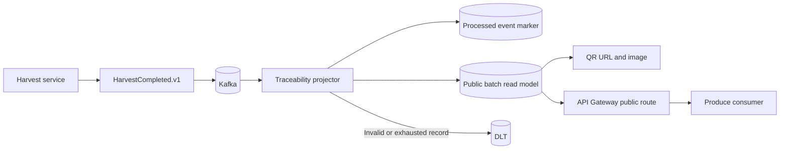

# Traceability data flow

The public API reads only the Traceability database. It does not join Farm,
Work, Harvest, or Inventory databases at scan time. The projector stores only
contract-approved product, farm, plot, harvest, quality, care-summary, and batch
fields; internal identifiers and employee data are not returned.
