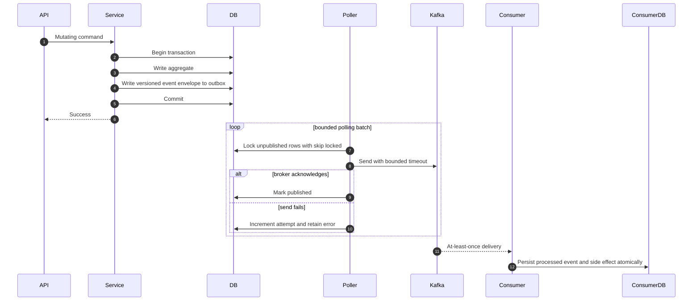

# Transactional outbox flow

Pollers expose backlog metrics and keep failed rows repairable. Sales and
Notification retain quarantined rows for the bounded
`OUTBOX_QUARANTINE_RETENTION` recovery window (default `P7D`); operators must
review or repair them before cleanup. Other services retain unpublished evidence
until their recovery path resolves it.
